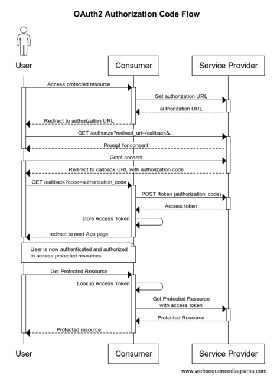

# OAuth2 Email Bridge PoC

The application suite whose source is contained within this folder serves as a Proof of Concept (PoC)
and example implementation of a web application leveraging [OAuth2] to allow users to access their
e-mail resources hosted on e-mail Service Providers (e.g., Google Gmail, Microsoft Outlook) to satisfy
requirements of a Consumer (such as this PoC) application.

## Demo

The following demo captures a session in which the application sends and receives email on behalf of
its user in both Gmail and Outlook.

Towards the end of the demo, the "sequence log" (recorded by the application to reflect the flow of
actions taken by the user) is pasted into [websequencediagrams.com](https://www.websequencediagrams.com)
to illustrate the OAuth2 flow that transpired.


https://github.com/user-attachments/assets/8e97874b-09f2-47db-bf91-2f531c6d0e77


## Components

The (source) components of this project include those in the sub-folders:

- [backend](./backend/README.md)
- [frontend](./frontend/README.md)

## Challenge

Come up with a simple backend & frontend allowing users to send & receive e-mails for
a particular application.  The following set of "email backbones" should be supported:

- Google GMail
- Microsoft Outlook

The authorization protocol [OAuth2] will be used to grant the application access to the
needed APIs on these e-mail backbones.

## OAuth2 Sequence Overview

The following sequence depicts a generalization of an [OAuth2] flow of control used by a Consumer
app (such as this one) to gain authorization to access functionality in a Service Provider (such
as Google GMail) on behalf of a user.



If you paste the following text into the [websequencediagrams.com App](https://www.websequencediagrams.com/app),
you can customize the sequence and explore the interaction in more detail, as your needs require.
```wsd
title OAuth2 Authorization Code Flow

actor User as User
participant Consumer as Backend
participant Service Provider as OAuth2

User -> Backend: Access protected resource
activate User
activate Backend
Backend -> OAuth2: Get authorization URL
activate OAuth2
OAuth2 --> Backend: authorization URL
deactivate OAuth2
Backend --> User: Redirect to authorization URL
deactivate Backend
User -> OAuth2: GET /authorize?redirect_uri=/callback&...
activate OAuth2
OAuth2 --> User: Prompt for consent
deactivate User
User -> OAuth2: Grant consent
activate User
OAuth2 --> User: Redirect to callback URL with authorization code
deactivate OAuth2
User -> Backend: GET /callback?code=authorization_code
activate Backend
Backend -> OAuth2: POST /token (authorization_code)
activate OAuth2
OAuth2 --> Backend: Access token
deactivate OAuth2
Backend -> Backend: store Access Token
Backend --> User: redirect to next App page
note over User, Backend: User is now authenticated and authorized\nto access protected resources
deactivate Backend
deactivate User
User -> Backend: Get Protected Resource
activate User
activate Backend
Backend -> Backend: Lookup Access Token
Backend -> OAuth2: Get Protected Resource\nwith access token
activate OAuth2
OAuth2 --> Backend: Protected Resource
deactivate OAuth2
Backend --> User: Protected resource
deactivate Backend
deactivate User
```

## Additional Resources

There are _lots!_ of relevant and interesting resources and guides on the internet to help a developer
leverage OAuth2 for authorization to access Service Providers in their applications.  Unfortunately,
many of these provide conflicting or out-of-date information.

Some of the more helpful resources I've found relevant to this project include:

- [what-is-oauth](https://www.varonis.com/blog/what-is-oauth)
- [medium.com/@tony.infisical](https://medium.com/@tony.infisical/guide-to-using-oauth-2-0-to-access-google-apis-dead94d6866d)
- [oauth2-diagrams](https://www.gabriel.urdhr.fr/2023/02/06/oauth2-diagrams/)
- [authorization-code-flow](https://auth0.com/docs/get-started/authentication-and-authorization-flow/authorization-code-flow)
- [oauth.net](https://oauth.net/2/)
- [ngrok](https://ngrok.com/)

[OAuth2]: https://oauth.net/2/
