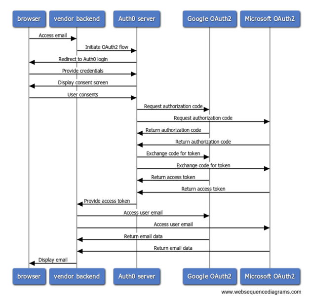

# Centralized OAuth2 Service Provider

A significant clarification gained from carrying out this PoC is the realization of the
need for ... _something else_...

## Registration Nightmare!

For an important use case in which a vendor provides software installed locally at each of
its more than 100 customer locations, an inordinately high installation and support cost
would be required for managing the needed OAuth2 registrations across all of desired
e-mail providers (e.g., Gmail, Outlook mail, etc.).  In this case, each customer site
would need to create and maintain its own OAuth2 registration (i.e., to obtain the needed
"client id", "client secret", "callback URL" values, etc.)  The vendor does not have
agency - or desire - to provide the manpower, expertise or guidance needed at each
customer site needed for this purpose.

As a potential solution to help reduce this additional burden for installation and 
management, leverage of a centralized OAuth2 server (such as one which could be 
created with the help of [Auth0]) is proposed.

While each customer in the modified scenario will (still) need to register their site
for use with OAuth2, the setup and management process for that would be carried out in
a _centralized_ location (i.e., within the cloud) managed by the vendor.  That process
could be streamlined and documented by the vendor, in a consistent way, for providing
access to email across all email providers supported by the vendor application.

Another group of seemingly relevant toolsets which might help in accomplishing
this goal:

- [Auth0] - [auth0 GitHub](https://github.com/auth0)
- [Gluu] - [GluuFederation](https://github.com/GluuFederation)
- [OpenID] - [openid GitHub](https://github.com/openid)

### Ideation

A proposed high-level interaction leveraging `Auth0` is depicted below:

#### Sequence Overview using `Auth0`



##### Sequence Diagram Source 

```wsd
browser->vendor backend: Access email
vendor backend->Auth0 server: Initiate OAuth2 flow
Auth0 server->browser: Redirect to Auth0 login
browser->Auth0 server: Provide credentials
Auth0 server->browser: Display consent screen
browser->Auth0 server: User consents
Auth0 server->Google OAuth2: Request authorization code
Auth0 server->Microsoft OAuth2: Request authorization code
Google OAuth2->Auth0 server: Return authorization code
Microsoft OAuth2->Auth0 server: Return authorization code
Auth0 server->Google OAuth2: Exchange code for token
Auth0 server->Microsoft OAuth2: Exchange code for token
Google OAuth2->Auth0 server: Return access token
Microsoft OAuth2->Auth0 server: Return access token
Auth0 server->vendor backend: Provide access token
vendor backend->Google OAuth2: Access user email
vendor backend->Microsoft OAuth2: Access user email
Google OAuth2->vendor backend: Return email data
Microsoft OAuth2->vendor backend: Return email data
vendor backend->browser: Display email
```

[Auth0]: https://auth0.com/
[Gluu]: https://www.gluu.org
[OpenID]: https://openid.net
